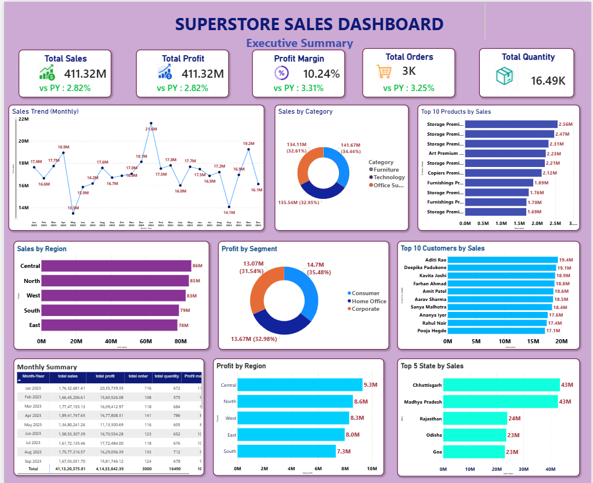

# Sales_analysis_dashboard

# Project Overview

This Power BI dashboard provides a comprehensive analysis of Superstore sales performance, offering insights into revenue, profitability, customer behavior, product performance, and regional sales trends. The dashboard enables business stakeholders to monitor key metrics, identify growth opportunities, and make data-driven decisions.

# Key Features
. Analyzed sales data across products, customers, regions, segments, and states.
. Tracked key business KPIs including:
     . Total Sales
     . Total Profit
     . Profit Margin
     . Total Orders
     . Total Quantity Sold
. Monitored monthly sales trends to evaluate business performance over time.
. Identified top-performing products, customers, and states by sales contribution.
. Compared profitability across different regions and customer segments.
. Interactive and user-friendly dashboard design for quick business insights.

# Dashboard Insights
. Generated ₹411.32M Total Sales and ₹41.33M Total Profit.
. Achieved a 10.24% Profit Margin.
. Processed 3,000 Orders with 16.49K Units Sold.
. Technology category contributed the highest share of sales.
. Consumer segment generated the largest portion of profit.
. Central and North regions recorded the highest profits.
. Chhattisgarh and Madhya Pradesh emerged as the top-performing states by sales.
. A small group of customers contributed significantly to total revenue.

# Dashboard Components
. Executive KPIs
    . Total Sales
    . Total Profit
    . Profit Margin
    . Total Orders
    . Total Quantity
. Sales Analysis
    . Monthly Sales Trend
    . Sales by Category
    . Top 10 Products by Sales
. Customer Analysis
    . Top 10 Customers by Sales
    . Profit by Customer Segment
. Geographic Analysis
   . Sales by Region
   . Profit by Region
   . Top 5 States by Sales

# Summary Table
. Monthly Sales & Profit Summary
. Order and Quantity Performance Tracking

# Tools & Technologies
. Power BI
. Power Query
. DAX
. Data Modeling
. Data Visualization
. Excel/CSV Dataset
 
# Business Impact
. This dashboard helps organizations:

  .  Monitor sales and profitability in real time.
  .   Identify top-performing products and customers.
  .  Optimize regional sales strategies.
  .  Improve inventory and product planning.
  .  Support data-driven business decision-making.

# Dashboard Preview
  
